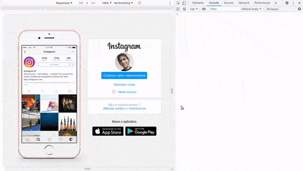

  

# Instagram clone

## Objetivo:
Fixar conceitos sobre HTML e CSS ao Recriar a página de login do Instagram

## Conceitos aprendidos:
- Criação de página HTML
- Utilização de classes e ID para identificação
- Flexbox
- Responsividade por meio de media-queries
- Alteração de tema (Adicional criado por mim)

## Fonte do treinamento:

[Bootcamp - HTML Web Developer](https://web.digitalinnovation.one/track/html-web-developer?tab=path)

## Demo:

